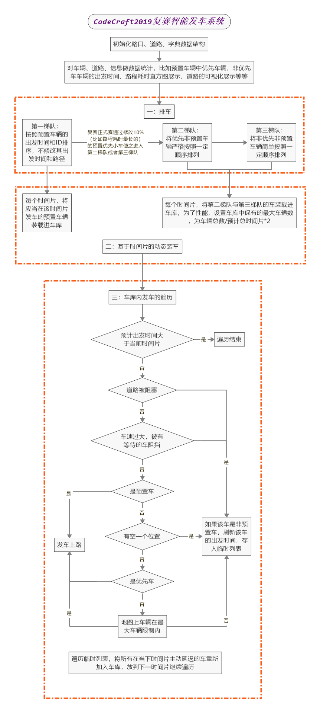

# CodeCraft2019复赛南川版智能发车系统使用说明

## 流程控制


## 两种模式
- 正常模式，即使用自定义的流程与算法生成答案，启动路径CodeCraft-2019.py
- 模拟模式，即模拟官方判别器，该模式将会读取对应地图里的answer.txt文件，启动路径CodeCraft-2019_judge.py

## 目录结构
- base.py 提供了两种启动模式，主要为了解决在IDE中使用命令行启动较为繁琐的问题，并针对各自的main函数适配了log日志文件的位置
- core.py 定义了主类Core，它继承base.Base类，在Core中只定义一些必要的初始化和核心的算法函数，因此要修改模型只需要在Core中修改即可，其他部分的代码可以当做模块使用无需更改
- core_judge.py 定义了主类CoreJudge类，它也集成base.Base类，用于运行官方判别器
- car.py, road.py, cross.py 分别定义了Car, Raod, Cross 三种对象，实现小车与道路、路口、Core的联动
- data.py 定义了Data类，为收集程序运行过程中每个时间片的信息而生，配合Core使用，Core类中亦有定义一个transfer函数将Core的部分数据同步给了Data
- utils.py 提供了一些通用的函数，比如读取文件、格式化文件、生成最短路径、生成答案等
- settings.py 配置你要使用的一些信息，比如选择地图、是否启动模拟模式，以及修改一些暴露的参数等
- CodeCraft-2019.py 启动主程序文件，直接运行即可，也可使用官方的命令行启动模式，已在base.py中定义好两种接口
- CodeCraft-2019_judge.py 启动模拟模式


## 一些属性
### 小车的属性
- 速度
- 出发地和目的地，引申至发车时间

## 道路的属性
- 长度
- 宽度
- 限速
- 出发地和目的地


## 重要的调度环节
- 排车，位于core.quick_sort_cars（快排）和core.sort_cars（严排）
- 装车，位于core.load_cars
- 发车，位于core.depart_cars

> 其中，排车、装车、发车环节在模拟模式中都已经固定好，无法调整，也请不要修改任何```if self.ENABLE_JUDGEMENT:```语句下的内容。
而在正常模式中，主要修改排车、装车、发车部分的算法。

### 排车

### 装车

装车，在本系统中，指将（系统设定或主动调节后的）实际出发时间小于或等于当前时间片车装载到车库中，
预置车和非预置车有不同的装车方案，因为预置车无法主动顺延出发时间，因此我们的系统中每一次装车是分两步的，
- 第一步：将符合规定的预置车装载到车库内，这里，唯一的判定就是系统预设的实际出发时间，而且必须装。
- 第二步，将符合规定的非预置车装载到车库内，这里，有很多自定义的空间。
在我们的系统中，我们暂时选择了当车库内待出发的车辆数达到一定阈值时，就不再装非预置车。
换言之，我们对排序步骤里可能已经主动延迟的小车在装车环节里进一步延迟

这里，有几点值得关注
- 排车是在系统运行之初，就初始化的，也就是说只要运行一次，但装车是每个时间片都要装一次的，以保证实时、轻量
- 在每个时间片里，将会有两次装车
    - 第一次是在标定完道路上小车之后，此时，我们只装优先车辆，因为接下来只发优先车辆，我们没有必要装普通车
    - 第二次是在循环调度完所有道路上的小车后（或者继调度完当前时间片最后一次发优先车后，这个更好），
    此时，我们只装非优先小车，因为接下来只发非优先车
- 以上的装车顺序十分重要，假设你在循环调度阶段也装了一次优先车，并在循环调度阶段使新装的小车上了路，
自己的调度器可能正常运行，但是生成的答案里面，由于在循环调度阶段和在标定阶段装的小车、发的小车是同一时间的，
因此就可能发生在官方判定器里其实是循环调度阶段装的车先上路的情况，与本地系统实时运行的结果不一致。
而非优先小车其实在发非优先小车之前的任意阶段皆可，为了保证装车时的信息是最新的，我们直接放在非优先车上路之前。

### 发车

发车，在本系统中，是指使装载好存放在车库内的小车根据官方判定器的优先对列顺序遍历判断能否上路。
因为使用了优先队列，因此这里的发车顺序基本不会错乱，换言之，对于装车环节里装的任意一辆车，发车时都不会错乱。

### 时间线
1. 标定道路上的小车（调度步骤一）
2. 装优先车
3. 发优先车
4. 循环调度道路上正在等待的小车（调度步骤二）（中途一旦有车过路口，对该路口发优先车）
5. 发优先车
6. 装非优先车
7. 发非优先车


# 基于交通流量动态不确定下的智能排车、装车、发车方案全解析V2.0

## 判别器实现的要领、步骤与注意事项

## 为什么本地判别器判别结果与小地图数据不一致
### 系统设计问题
### 评分精度问题

## 为什么本地判别器与小地图数据一致，但与上传到服务器的程序模拟结果不一致
### 发车排序问题
### 答案保存问题

## 快速排车与全序排车的比较及排车方案的指标选取与优先考虑

## 静态装车与动态装车的性能与需求及动态路权调整的开销与收益权衡

## *智能算法在优化发车方案中的价值与应用

## 应对死锁的解决方案参考：*数学推导、回滚机制、数据统计及可视化

## 基于论坛单步调度器的一些可视化方案思考

> 作者：南川，江山赛区SpiderMen队。


